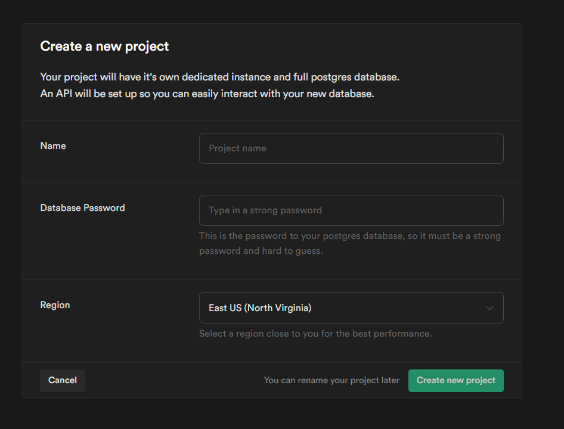
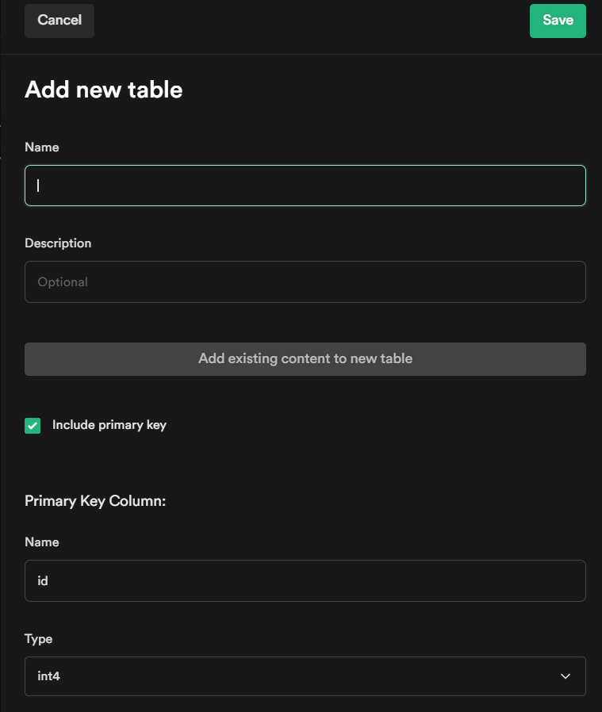

# unique-visitor
Get our own unique visitor counter for your github readme

## Table Of Contents
- [Getting Sarted](#getting-started)

## Getting Started
Follow these easy steps to setup your own unique visitor counter for your github reademe profile.
> As of now we are using [supabase](https://supabase.io/) for storing data so you need to setup supabase to use this application. 

To setup [Supabase](https://supabase.io/) follow thier documentation. 

### Supabase Setup
You not only need supabase `ENV` variables but also setup a table. 

### `ENV`
- `supabaseUrl` - supabase url 
- `anonPublicKey` - supabase anon public key
- `githubUserName` - Your github username for the dashboard

### Deploy 
The application is built using (nextjs)[https://nextjs.org/] so just fork this repo and then you can deploy as you like just mind the `ENV` variables and supabase setup.

- Open a project in supabase.
    
- From the side menu select `+ New table` option. 
    - fill `visitors` in the **name** parameter and leave the rest as it is. 

    
- Now add two columns
    1. Name: `ip`, Type: `text`, Allow Empty: `false`, Default Value: `NULL`
    2. Name: `count`, Type: `int8`,Allow Empty: `true`, Default Value: `1`

---
If you are deploying using vercel you can use this button as well. 

---
